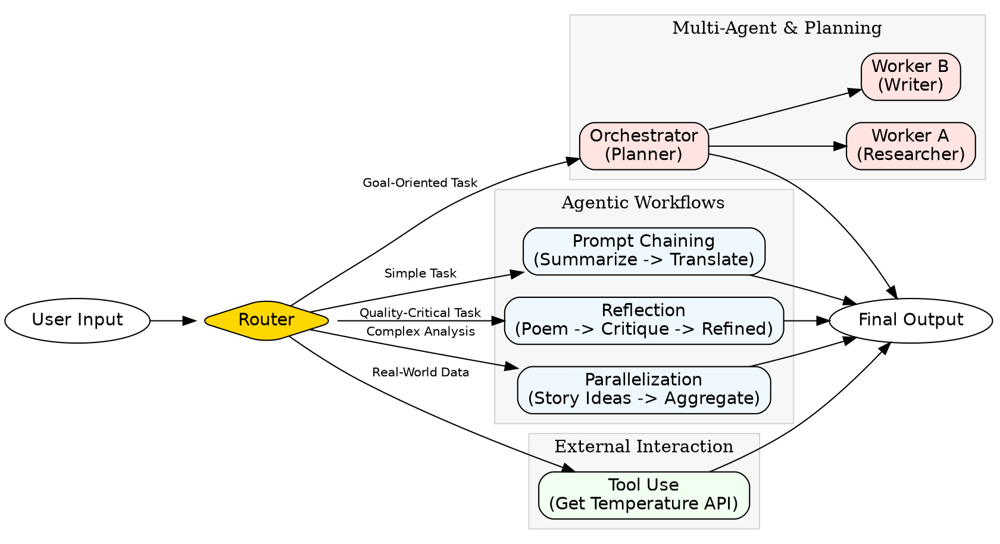
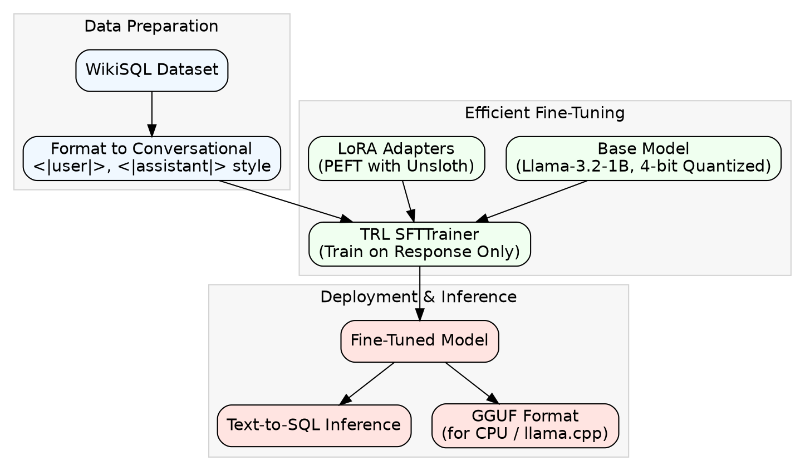

# LLM Agentic Patterns & Fine-Tuning Showcase

This document provides a technical overview of two key projects demonstrating proficiency in designing and building advanced AI systems.

1.  **Agentic Design Patterns:** Implementation of multiple workflows that enable LLMs to perform complex, multi-step tasks beyond simple text generation.
2.  **Text-to-SQL Fine-Tuning:** Specializing a compact language model (Llama-3.2-1B) for the high-value task of converting natural language questions into SQL queries using efficient fine-tuning techniques.

---

## 1. Agentic Design Patterns Implementation

This project showcases the architectural patterns required to build robust, scalable, and intelligent AI agents. These patterns allow an LLM to reason, plan, self-correct, and interact with external tools.

### System Architecture

The following diagram illustrates the implemented workflows, orchestrated by a central router that selects the appropriate pattern based on the user's query.



### Patterns Demonstrated

#### a. Prompt Chaining (Sequential Processing)
- **Concept:** The output of one LLM call is used as the input for the next, creating a processing pipeline.
- **Example:**
    - **Input:** A long block of text.
    - **Step 1 (Summarizer):** "Summarize the following text in one sentence..."
    - **Step 2 (Translator):** "Translate the following summary into French..."
    - **Final Output:** The French translation of the summary.

#### b. Routing (Conditional Logic & Specialization)
- **Concept:** A router model first classifies the user's intent and then directs the query to the appropriate specialized agent. This improves accuracy and efficiency.
- **Example:**
    - **Input:** "What is the capital of France?"
    - **Router Output:** `{ "reasoning": "The query is about general knowledge...", "category": "OTHER" }`
    - **Action:** The query is routed to a general-purpose agent that provides a helpful response for out-of-scope questions.

#### c. Reflection (Self-Correction & Quality Improvement)
- **Concept:** An iterative loop where one agent generates content (e.g., a poem) and a "critic" agent evaluates it against a set of criteria. The feedback is then used to refine the output. This is crucial for tasks requiring high quality.
- **Example:**
    - **Initial Poem:** (Incorrectly two lines) "With circuits humming, cold and bright, A metal hand now holds a broom"
    - **Critic Feedback:** "FAIL: The poem does not meet the four-line requirement."
    - **Refined Poem:** (Using feedback, a correct 4-line poem is generated) "With circuits humming, a canvas bright, It mixes hues with all its might. Its metal hand, a steady guide, New art is born with gears inside."

#### d. Tool Use (Connecting to External Systems)
- **Concept:** The LLM is given access to a set of function declarations (tools). When it determines a tool is needed to answer a query, it outputs the function name and arguments to call.
- **Example:**
    - **Input:** "What's the temperature in London now?"
    - **Model Output (Function Call):** `get_current_temperature(location='London')`
    - **System Action:** An external weather API is called with "London".
    - **Final Response:** The LLM generates a natural language response based on the API's result: "The temperature in London is 15 degrees Celsius."

#### e. Planning & Multi-Agent Systems
- **Concept:** For complex goals, an orchestrator agent first decomposes the goal into a multi-step plan. Each step is then assigned to a specialized "worker" agent (e.g., Researcher, Writer) for execution.
- **Example:**
    - **Goal:** "Write a short blog post about the benefits of AI agents."
    - **Generated Plan:**
        1.  `Task`: Research applications and benefits. `Assignee`: Researcher.
        2.  `Task`: Identify 3-5 key benefits. `Assignee`: Researcher.
        3.  `Task`: Outline the blog post structure. `Assignee`: Writer.
        4.  `Task`: Write each section with examples. `Assignee`: Writer.

[Basic AI patterns with gemini](https://github.com/philschmid/gemini-samples/blob/832cb1cb2528565d6a620d1ae45e2efdd1760207/guides/agentic-pattern.ipynb)

---

## 2. Fine-Tuning a Llama 3.2 Model for Text-to-SQL

This project demonstrates the process of specializing a compact, general-purpose language model for the task of converting natural language questions into executable SQL queries.

### Fine-Tuning Process

The workflow emphasizes efficiency and modern best practices, from data preparation to model deployment.



### Key Techniques & Rationale

-   **Model:** `unsloth/Llama-3.2-1B-Instruct`. A compact but powerful base model suitable for specialization.
-   **Efficiency (`unsloth`):** Integrated the `unsloth` library for 2x faster training speeds and ~70% less memory usage, making fine-tuning feasible on consumer-grade hardware (e.g., Colab T4 GPU).
-   **Parameter-Efficient Fine-Tuning (PEFT):** Employed **LoRA (Low-Rank Adaptation)** to inject trainable, low-rank matrices into the model's attention layers. This avoids the prohibitive cost of full fine-tuning by only updating a tiny fraction of the model's parameters (~1.13% in this case), while still achieving strong task-specific performance.
-   **Quantization:** Loaded the base model in **4-bit (`bnb-4bit`)** to significantly reduce the memory footprint, a critical step for managing large models in constrained environments.
-   **Instruction Tuning:** Formatted the `wikisql` dataset into a conversational, instruction-following format. By using the `train_on_responses_only` method, the training loss was masked for the input prompt, forcing the model to focus exclusively on learning to generate the correct SQL output.

### Results: Before vs. After Fine-Tuning

This demonstrates the model's improved ability to generate a correct and concise SQL query after just 16 training steps.

**Input Question:** `What position does the player who played for butler cc (ks) play?`

**Table Context:** `Header: ['Player', 'No.', 'Position', 'School/Club Team']`

**Before Training:**
The base model hallucinates an incorrect query and provides extraneous conversational text.
```sql
-- Incorrectly queries by 'No.' and fabricates a WHERE clause.
SELECT Player
FROM table_name
WHERE No. = 21;
```

**After Fine-Tuning:**
The model correctly identifies the target column (`Position`), the condition column (`Player`), and the value (`martin lewis`), producing a clean, accurate query.
```sql
SELECT Position FROM table WHERE Player = martin lewis
```

### Deployment
The fine-tuned LoRA adapters were saved and also merged with the base model to create quantized **GGUF** files. This final step makes the specialized model highly portable and ready for efficient CPU-based inference in production applications using tools like `llama.cpp`.
